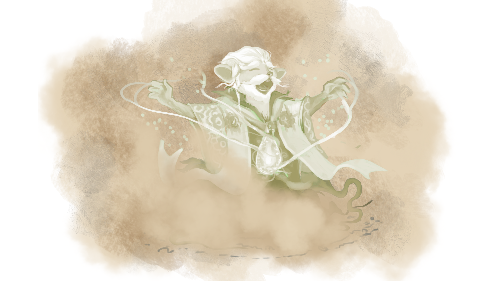

# Looking Glass Incident #2, Report 1
---
The initial exploration of the Folklore Forest has shown that reality in this place seems to reform based on the thought of those observing. For this reason, according to Royal Decree 9, this, as well as any other report in name of His Majesty the King, will include any reasonable opinion, interpretation and hunch regarding the explored area.  

 ---
   
Since the discovery of the Table of Contents, a frantic write-off has been taking place there between the best hunters Gnawnia has to offer and the Mythweaver. Thankfully, the hunters have had the upper hand for the vast majority of this seemingly never-ending struggle.  
Despite this literary dominance, a bewildering, concerning development emerged five Gnawnian hunts into July. Knowing the risks of this information spreading, this has been kept silent until a Royal Exploration Team could be dispatched to explore the consequences of what happened.  

On this fateful day, the Mythweaver seemed to be keeping it quite calm for an unusual length of time. Without any warning, trees in the forest around the Table of Contents suddenly started vanishing. This opened up two paths: one leading towards an eerie Shrine and one leading towards a terrifying cliff. This report will primarily focus on our findings regarding this Incident and our attempt to approach the shrine.

The Mythweaver's sudden outburst did more than simply opening a new path deeper into the Forest, it also deeply changed the stories told by mouse- and mankind alike. The only people aware of their sudden appearance are those who joined the last expedition into the Folklore Forest, but both the native population of the forest and anyone residing in Gnawnia seems to believe these have always existed. These stories talk about a mysterious character referred to as 'the Saint'. While stories vary wildly between them being a benevolent guardian and an evil, vengeful God, there are some recurring themes. When it comes to origins, all stories talk about a little mouse whose entire being could be condensed down to its creativity and curiosity, eventually getting corrupted by something and losing themselves in the process.  

Any stories involving its current residence talk about a silent sanctuary, a solemn, shady shrine as a hidden secret in a forest, being sought after by those who seek to shed their sins, and found by those with a stylish enough solo.  

Due to the volume and variety in stories regarding the Saint, their transcriptions are not included in this entry, but their value will be provided through different reports after their veracity has been verified.  

Assuming these stories are but the tip of the iceberg, I fear what else may have been added or removed from the depths of society's subconsciousness.

On the road towards the shrine, a Rapping Rabble Rouser mouse could be seen. This odd critter seems to live for the rhythm and the rhyme, seeking for his time to shine. For a site as holy as a shrine he looks out of place, but you'd better not tell him that to his face. He always looks ready for a fight, not even god knows his true plight. If you get too close he'll start his rap, which he'll clear in no time, then he leaves with a dab. So don't get too near 'cuz he'll an L is what you'll eat, and out of nowhere there'll suddenly be a beat.  

At time of writing, we have not managed to reach the Shrine yet. The stories we have heard so far are conflicting on what we might find there: our dear rapper told us about all his fellow musicians hanging around the shrine, an odd book that suddenly appeared in the Table of Contents talked about a cartel of speech-obsessed criminals and the stories about the Saint seem to fit the Shrine perfectly as well. Clarifying what is actually taking place at this Shrine will be the goal of the next report.